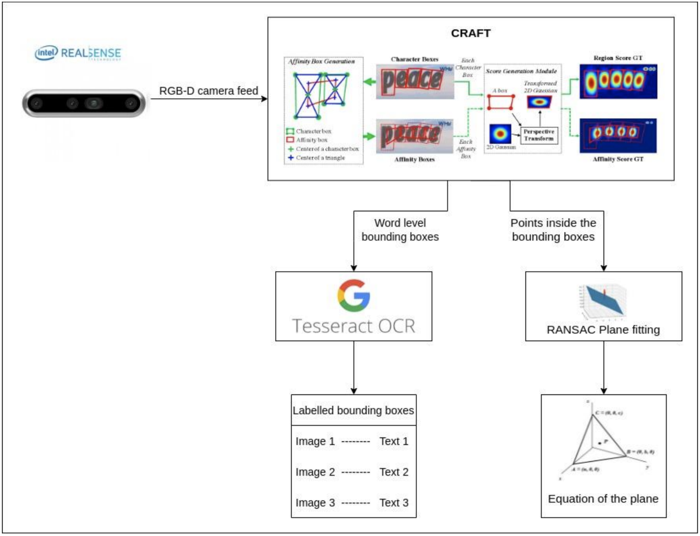
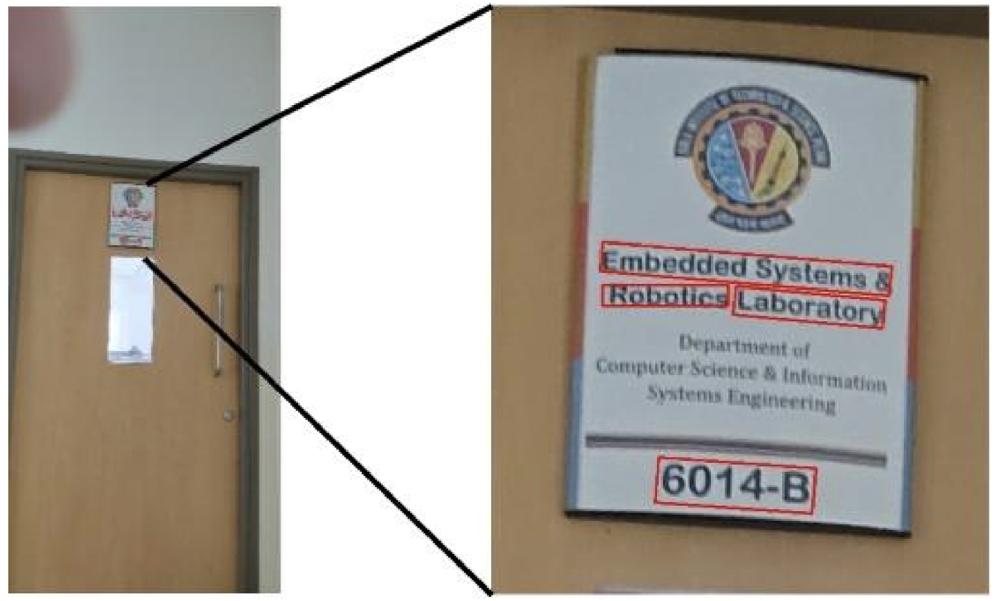
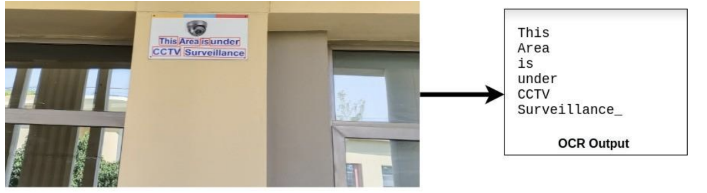

# Text-Based-Signage-Recognition

This project was done as a university semester project and a detailed report can be found here: https://drive.google.com/file/d/1t8QUQD9CE6H7CvnfsxBE2c3DCQIlNLfI/view

The aim of the project was to design a system that would take the RGB-D camera feed as input, segment it and then output the text on signboards along with the plane in which the text exists. This project will be used to build an end-to-end wearable blindness assistive device that would be smart enough to recognize texts, signboardsword-levelislabeled, and banknotes with high precision.

## Proposed Pipeline

The pipeline consists of four main steps:  
● Fetching the live camera feed. 
● Text segmentation using CRAFT 
● Text recognition using Tesseract OCR 
● Plane Fitting using RANSAC 

## Text Segmentation
After fetching the camera feed the next step is text segmentation. For this purpose Character Region
Awareness for Text Detection (CRAFT) was chosen.

### Testing CRAFT
The model was tested on images taken from the surroundings near the INSPIRE lab. The results were very good as almost all words were segmented even in blurred images. One of these is shown below.

## Text Recognition
The next step of the pipeline is text recognition. CRAFT provides cropped images with texts in them and the OCR outputs the text written in the images. Tesseract OCR is considered the state-of-the-art model when it comes to optical character recognition. It was the HP Research Prototype in the UNLV Fourth
Annual Test of OCR Accuracy.

### Inference and Testing
An example of the output from tesseract OCR is shown below. 

## Plane Fitting
The final step was to extract the plane of the text from the given set of points. For this task, the RANSAC algorithm was used as it is a robust plane fitting model in the presence of many data outliers. The time taken by the algorithm will depend on the maximum number of iterations which can be altered depending on the required level of accuracy.